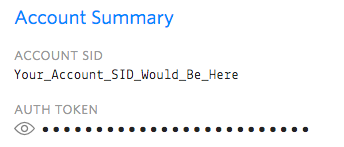

# 📨Shell-SMS-Shender
A Simple command line tool to send SMS from the command line using the Twilio API.

## Send SMSes Swiftly right from your Shell


## Getting Started

1. Clone the repo. `git clone https://github.com/CT83/Shell-SMS-Shender.git`, cd into it
2. `chmod 775 sss-client `
3. Head to the Twilio console. Either log-in or sign up for a free account, and look for the Account Summary, make sure you have already [bought a Twilio Phone Number](https://support.twilio.com/hc/en-us/articles/223135247-How-to-Search-for-and-Buy-a-Twilio-Phone-Number-from-Console).



3. Copy the credentials and your phone number in a new file `.config`, and add it to the root of the repo, like so.

   ```bash
   ACCOUNTSID=XXXXXXXXXXXXXXXXXXXXXXXX
   AUTHTOKEN=XXXXXXXXXXXXXXXXXXXXXXXXXX
   CALLERID=507-697-0XXX
   ```

4. Done! Type `./sss-client` 
5. Check your Phone for the SMS!

## License

MIT License. You are free to do anything. 🙃

## References

I found [this](https://www.twilio.com/labs/bash/sms) too by Twilio while researching, I modified it to suit my needs.